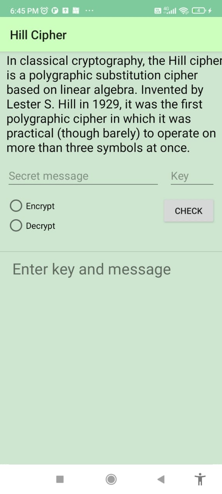

# Classical Encryption Algorithms
This project implements the classical Cyrptography algorithms:

which include:
## Caesar Cipher

## Play Fair Cipher
   
## Hill Cipher
   
## Rail Fence Technique
   
*Sherlock's tools because I am a fan!*